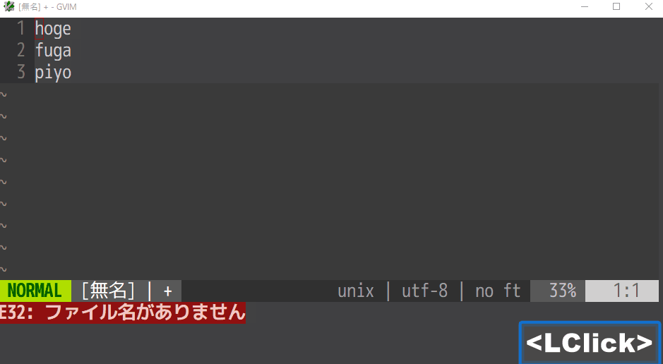

# はじめての Vim

## 目的・背景

2022 年現在、テキストエディターは Visual Studio Code が良く用いられるようになってきています。  
それに伴い、古典的なテキストエディターである、Vim や Emacs などを使用するユーザーは少なくなっているように見受けられます。  
しかし、それら古典的なエディターについても開発や新しい機能の追加は実施されており、  
Vim や Emacs をメインのエディターとして使用するユーザーも根強く存在する現状となっています。  

そのような昨今のテキストエディターの情勢を踏まえ、  
このコンテンツでは、 Vim というエディターについて初歩的な知識をまとめ、  
Vim というエディターを知らない人が Vim の事を知るための情報をまとめています。  

このコンテンツを通じて、必ずしも実際に Vim を使用するようになる必要はないと考えています。  
Vim がどのような考え方で設計されているかを知るだけでも、ソフトウェア開発者としての学びがあることを意識して、  
このコンテンツは作成されています。

## 概要

本コンテンツでは主に、Vim に特徴的な「モード」という概念を中心に、  
そのモードごとにどのようにテキスト編集を行うかについて説明します。  
また、別途 Vim の歴史的な概要や、Visual Studio Code の特徴の比較についても、  
簡単にまとめて掲載しています。

## 目次

1. Vim とは
2. Visual Studio Code の特徴との比較
3. モードについて
4. 各モードごとの基本的な操作
5. Vim で実践できる便利なテクニック
6. 参考文献

## 1. Vim とは

> Vimはオランダ人のプログラマー、ブラム・モールナールによってAmiga向けに開発された。  
> のちにWindowsを含むさまざまな環境に移植され、特にUnix系オペレーティングシステム  
> (OS) ではEmacsと並んで広く使用されているテキストエディタとなっている  
> https://ja.wikipedia.org/wiki/Vim

Vim は現在 Github にてソースコードが管理されており、  
ブラム・モールナール氏と世界中の有志の開発者によって開発が勧められています。  
https://github.com/vim/vim

## 2. Visual Studio code の特徴との比較

Vim と Visual Studio Code の特徴はそれぞれ以下です。    

### Visual Studio Code

* Electron エンジンを活かしたリッチな GUI 操作/表現
    * Web と同じ技術基板が使用されているため、グラフィカルな表現が得意
    * Vim では実現ができないソースコードの表示方法も実現できる
        * Vim は基本的に CUI の中で動いている形で動作しているため
* 使用開始からすぐに高い生産性を得られる
    * 一般的なエディターと同じ操作感で使用できる
    * 拡張機能やショートカットなどの使用方法がわかりやすくなっている
    * 学習曲線は Hill Equation のイメージ
        *   
        * https://www.physiologyweb.com/calculators/hill_equation_interactive_graph.html より引用

### Vim

* 高度に最適化された CLI ベースの操作/表現
    * CUI ベースで設計されているため、コマンド同士の連携などが得意
    * 操作が全てコマンドの組み合わせという思想で設計されており、様々な組み合わせで強力な編集が可能
    * 全ての操作にマウス操作が一切必要ない
* 使用開始からしばらくは生産性を上げにくい
    * 一般的なエディターと操作感が異なるため基本的な操作の習得に時間がかかる
    * 拡張機能やショートカットへのアクセスがコマンドベースのため、理解に時間がかかるが効率的に行える
    * 上記 2 点を理由に操作に慣れてくると効率的にテキスト編集を行えるようになる
    * 学習曲線は Exponential のイメージ
        *   
        * https://content.nroc.org/DevelopmentalMath/U18L1T1_RESOURCE/text.html より引用

## 3. モードについて

Vim は他のエディターにはない、「モード」という概念があります。  
Vim を操作する際は、モードを切り替えながら操作を実施します。  

https://qiita.com/yamamoto_hiroya/items/31ce5bef451d9e3be225 より引用

各モードは、以下のような作業のために用います。

* ノーマルモード
    * デフォルトのモード 
    * コマンドをタイプすることにより、編集位置の変更、文字/文字列の削除等を行う
* インサートモード
    * 文字を入力するモード
    * 一般的なテキストエディターの編集操作と同様に文字の追加や BackSpace/Del による削除を行う
* ヴィジュアルモード
    * 選択範囲を指定するモード
    * 選択範囲を指定し、続けて特定のコマンドを実行することにより、文字/文字列のコピー/カット/ペースト等を行う
        * コピー/カット/ペースト以外にも、選択範囲に対して様々なコマンドを実行することができる
            * (Advanced な内容のため、本コンテンツでは取り扱いません)
* コマンドモード
    * Vim に実装された各コマンドを実行するモード
    * ユーザー定義のコマンドや、外部コマンドを実行することもできる
        * (Advanced な内容のため、本コンテンツでは取り扱いません)

## 4. 各モードごとの基本的な操作

以下へ各モードごとの基本的な操作を示します。  
gif に従い実際に動かしてください。  
ノーマルモード以外から能動的にノーマルモードへ戻る際は、`Esc` もしくは `Ctrl+[` をタイプします。

### ノーマルモード

#### カーソル移動

`h`, `j`, `k`, `l` で上下左右にカーソルを移動します。

  

### 単語移動(進む/戻る)

`w`, `b` で単語ごとに移動(進む/戻る)します。

  

### 1行コピー → ペースト

`yy` を実行してから、任意の行で `p` を実行して行をコピー → ペーストします

  

### 1文字削除

`x` を任意の文字の上で実行して 1 文字削除します。

  

### 1行削除

`dd` を任意の文字の上で実行して 1 行削除します。

  

### インサートモード

`i` でインサートモードへ入り、適宜文字を入力した後、`ESC` もしくは `Ctrl+[` にて、
ノーマルモードへ戻ります。

  

### ビジュアルモード

`v` でビジュアルモードへ入り、`hjkl` にて任意の範囲を選択し、  
`y` でコピーしてから `p` で貼り付けます。 
`p` の実行後は自動でノーマルモードへ戻ります。

  

## 5. Vim で実践できる便利なテクニック

以下へ Vim で実践できる便利なテクニックを紹介します。  
いずれも設定ファイルの変更や、プラグインの追加はなしで実行できます(Language Server を除く)。    

### 置換

コマンドモードで、以下のように `s(substitute)` コマンドを実行することで、  
正規表現にマッチした対象を置換することができます。

* `:%s/hoge/fuga/` → ファイル全体
* `:s/hoge/fuga/` → 選択範囲

  

### 仮想置換

ノーマルモードで、以下のコマンドをタイプすると仮想置換モードに入り、
カーソル以下の文字をタイプした文字で直接置換することができます。 
これは、ソースコードのコメントでカラムの統一されたものを書き換える作業に、  
有効な場合があります。

* `gR`

  

### グローバルコマンド

コマンドモードで、以下のように `g(global)` コマンドを実行することで、  
正規表現にマッチした対象へコマンドを実行することができます。
gif の例はマッチした対象へ `d(delete)` コマンドを実行しています。 
`g` の代わりに `v` を用いることで、「マッチした対象以外」にコマンドを実行することができます。

* `:g/<regex>/cmd`

  

### 連番生成

`g`(全体を指定する) コマンドと、`Ctrl+a`(数字をインクリメントする)コマンドを組み合わせて、
連番の生成をすることができます。  
ソースコードにおいて、連番を連続して並べたいなどに有効です。

* `g, Ctrl+a`

  

### バッファへの外部コマンドの実行

バッファ指定子 `%` と、外部コマンド実行コマンド `!` を組み合わせることで、  
現在のバッファへ外部コマンドを実行することができます。
以下の gif は、Windows 標準の `tree` コマンドの結果を現在のバッファへ適用する例です。

* `%!<cmd>`

  

### hex dump

Vim には `xxd` コマンドが同梱されており、  
そちらを利用してバイナリファイルを16進数値表示することができます。 
手順は前の「バッファへの外部コマンドの実行」と同様です。

* `%!xxd` → hex dump 表示に変換
* `%!xxd -r` → hex dump 表示からバイナリに戻す

  

### マクロ

Vim にはマクロ機能があり、任意の記録して再度実行することができます。  
置換操作で実現できない複数行に渡る繰り返しのテキスト処理等に有効です。

* q + 任意の key で記録開始
* q をタイプして記録終了
* @ + 任意の key でマクロ実行
* @@ で直前のマクロを再実行

  

### Language Server

Vim はサードパーティの Language Server のクライアントプラグインをインストールすることで、  
各プログラミング言語で Language Server の各機能を使用することができます。

  

## 6. 参考文献

* 『マスタリングVim』 技術評論社 Ruslan Osipov著 大倉雅史訳
* https://github.com/vim/vim
* https://ja.wikipedia.org/wiki/Vim
* https://howpon.com/21851
* https://qiita.com/hide/items/5bfe5b322872c61a6896